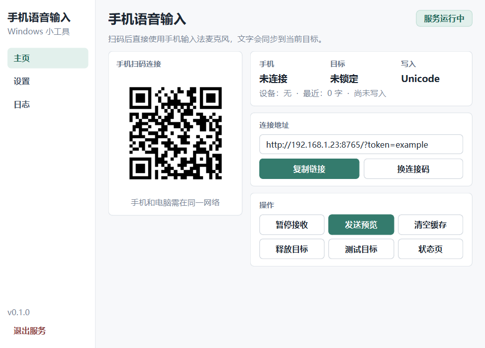

<div align="center">

# Phone Voice Win Input

**用手机输入法的麦克风，把语音文字实时写入任意 Windows 输入框。**

无需安装手机 App · 局域网直连 · Android / iOS · 本机与远程桌面

[](https://github.com/kun002/phone-voice-win-input/actions/workflows/ci.yml)
[](https://github.com/kun002/phone-voice-win-input/releases)
[](LICENSE)
[](https://github.com/kun002/phone-voice-win-input/releases)

</div>

<p align="center">
  
</p>

> 截图使用示例 IP 和示例 token 生成，不包含真实设备、个人路径或语音内容。

## 功能

| 能力 | 说明 |
| --- | --- |
| 手机语音输入 | 使用手机系统键盘或输入法自带麦克风，不调用浏览器语音 API |
| 实时同步 | WebSocket 增量同步，断线自动重连，并提供 HTTP 备用通道 |
| 目标锁定 | 开始说话时锁定 Windows 输入目标，支持本机应用、浏览器、Agent 和远程桌面 |
| 输入法纠错 | 允许手机输入法修正当前活动尾部，同时保护已经同步的前文 |
| 剪贴板保护 | 使用 `Ctrl+V` 模式时尽量恢复原文本剪贴板，不覆盖用户随后复制的新内容 |
| 电脑端控制 | 轻量 PySide6 GUI、二维码、设置、设备日志和系统托盘 |
| 隐私 | 不保存语音，不持久化正文；token、个人设置和二维码仅保存在本机并被 Git 忽略 |

## 下载

普通用户直接从 [Releases](https://github.com/kun002/phone-voice-win-input/releases) 下载：

```text
PhoneVoiceWinInput-Windows-x64.zip
```

1. 解压 ZIP。
2. 运行 `PhoneVoiceWinInput.exe`。
3. Windows 防火墙首次询问时，只允许**专用网络**。
4. 手机和电脑连接同一网络，扫描窗口中的二维码。

Release 是未签名的开源构建，Windows SmartScreen 可能显示“未知发布者”。源码和自动构建流程都在仓库中，可自行审查或构建。

## 使用

1. 在电脑目标输入框中放置光标。
2. 手机扫描 GUI 中的二维码。
3. 点击手机页面中央区域，唤起系统键盘。
4. 使用输入法麦克风说话，文字会自动写入锁定的电脑输入框。
5. 说完后直接在电脑应用中发送。

手机端只负责采集和传输，不显示正文、历史、设置或额外发送按钮。设置、目标释放、测试输入和日志都在电脑端完成。

## 工作方式

- 默认使用 `Unicode 直打`，远程桌面中不依赖 `Ctrl+V`。
- Windows 原生 `Edit` / `RichEdit` 控件会优先尝试后台写入。
- 浏览器、Electron、VS Code 等目标会回退到目标恢复和键盘输入。
- 目标窗口已经在前台时保留当前光标，可以把光标放到某个字后继续语音输入。
- 自动收尾默认 15 秒；结束后清空手机隐藏缓存并释放目标。
- 多台手机可以同时连接，但同一时间只有一台激活设备可以写入。

<details>
<summary><strong>输入同步、纠错和目标锁定细节</strong></summary>

自动同步只发送手机端新增后缀，不会每次用手机全文覆盖电脑输入框。因此在电脑端手动修改的文字会尽量保留。

手机输入法回头修正当前活动段时，工具会执行“删除旧尾部 + 写入新尾部”。短暂停顿后，已经同步的文字进入保护区，后续删除不能越过保护边界。如果输入法修改了保护区，工具不会重写电脑前文，而是从当前位置开始新段。

远程桌面通常无法向本机提供真实 caret。工具会记录开始输入时的目标窗口和可用位置；远程光标仍不稳定时，可以在设置中关闭“恢复记录的输入位置”。

目标锁默认会在无手机文本活动后自动释放。手机页面刷新、关闭、电脑端发送预览、清空缓存或手动释放目标时，也会结束当前输入段。

</details>

## 从源码运行

要求：Windows 10/11、Python 3.10 或更高版本。

核心服务仅使用 Python 标准库：

```powershell
git clone https://github.com/kun002/phone-voice-win-input.git
cd .\phone-voice-win-input
.\start.ps1
```

启动现代 GUI：

```powershell
python -m pip install -r .\requirements-gui.txt
.\start.ps1 -Gui
```

运行自检：

```powershell
python .\phone_voice_win_input.py --self-test
```

## 桌面 GUI

GUI 是紧凑小工具窗口，包含：

- **主页**：二维码、手机状态、目标状态、写入方式和常用操作。
- **设置**：剪贴板、写入方式、目标恢复、自动收尾和尾部纠错。
- **日志**：设备连接、目标、网络诊断和最近错误。

关闭窗口后默认隐藏到系统托盘，服务继续运行。托盘菜单可以显示窗口、暂停接收、复制手机链接、打开状态页或退出服务。

<details>
<summary><strong>命令行参数</strong></summary>

```powershell
python .\phone_voice_win_input.py --port 8899
python .\phone_voice_win_input.py --token my-secret
python .\phone_voice_win_input.py --reset-token
python .\phone_voice_win_input.py --no-token
python .\phone_voice_win_input.py --strict-port
python .\phone_voice_win_input.py --no-clipboard-protect
python .\phone_voice_win_input.py --no-target-click-restore
python .\phone_voice_win_input.py --no-foreground-restore
python .\phone_voice_win_input.py --return-previous-foreground
python .\phone_voice_win_input.py --target-lock-timeout 60
python .\phone_voice_win_input.py --no-qr
python .\phone_voice_win_input.py --gui
python .\phone_voice_win_input.py --hotkey ctrl+alt+p
python .\phone_voice_win_input.py --dry-run
python .\phone_voice_win_input.py --self-test
```

- `--port`：起始端口，默认 `8765`；不可用时自动尝试后续端口。
- `--token` / `--reset-token` / `--no-token`：管理局域网页面访问 token。
- `--strict-port`：端口失败时不自动切换。
- `--no-clipboard-protect`：本次运行关闭文本剪贴板恢复。
- `--no-target-click-restore`：关闭目标位置恢复。
- `--no-foreground-restore`：不主动将目标窗口置前。
- `--return-previous-foreground`：写入后尝试返回原窗口，属于实验选项。
- `--target-lock-timeout`：目标锁超时秒数，范围 `0-60`，`0` 表示关闭。
- `--hotkey`：设置暂停/恢复全局热键，例如 `ctrl+alt+p`。
- `--dry-run`：启动网页和接口但不发送键盘输入。

</details>

## 常见问题

### 手机无法连接

- 确认手机和电脑处于同一局域网。
- 允许 Python 或 EXE 通过 Windows **专用网络**防火墙。
- 多个二维码存在时，优先使用与手机相同网段的地址。
- 不要把服务端口直接暴露到公网。

### 端口报 `WinError 10013`

端口可能被 Windows、Hyper-V、WSL、代理或安全软件占用/保留。程序默认会自动尝试后续端口，也可以手动指定：

```powershell
.\start.ps1 -Port 8876
```

### 目标程序没有收到文字

- 先在目标输入框中点击并放置光标，再从手机开始输入。
- 目标程序以管理员运行时，本工具也需要相同权限级别。
- 远程桌面优先使用 `Unicode 直打`。
- 查看 GUI 的“日志”页确认最近实际写入方式和错误信息。

### 手机页面还是旧版本

刷新手机页面，或关闭后重新扫码。浏览器/PWA 可能短时间保留旧 Service Worker 缓存。

## 本地文件与安全

| 文件 | 用途 | 是否进入 Git |
| --- | --- | --- |
| `.phone_voice_token` | 持久化配对 token | 否 |
| `.phone_voice_settings.json` | 电脑端个人设置 | 否 |
| `last-phone-qr*.png` | 当前连接二维码 | 否 |
| 语音正文与预览 | 仅保存在当前运行内存 | 否 |

安全策略和漏洞报告方式见 [SECURITY.md](SECURITY.md)。

## 构建 Release

Windows 单文件使用 PyInstaller 构建：

```powershell
python -m pip install -r .\requirements-gui.txt -r .\requirements-build.txt
python -m PyInstaller --noconfirm --clean --onefile --windowed --name PhoneVoiceWinInput --hidden-import phone_voice_gui phone_voice_gui_entry.py
```

推送 `v*` 标签后，[Build Release](.github/workflows/release.yml) 会自动运行自检、构建 Windows x64 ZIP、生成 SHA-256，并发布到 GitHub Releases。也可以在 Actions 页面手动运行 workflow，只生成下载 artifact。GitHub 支持从 Actions 页面手动运行带 `workflow_dispatch` 的工作流。([GitHub 文档](https://docs.github.com/en/actions/how-tos/manage-workflow-runs/manually-run-a-workflow))

## 参与贡献

请阅读 [CONTRIBUTING.md](CONTRIBUTING.md)。修改 Windows 输入逻辑时，建议同时测试本机输入框、浏览器/Electron 和远程桌面。

## 许可证

本项目采用 [MIT License](LICENSE)。